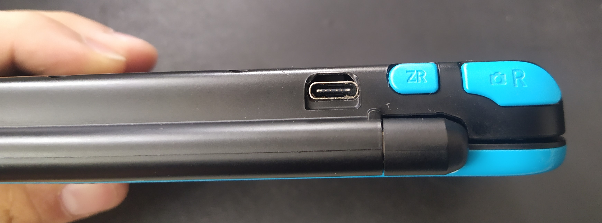
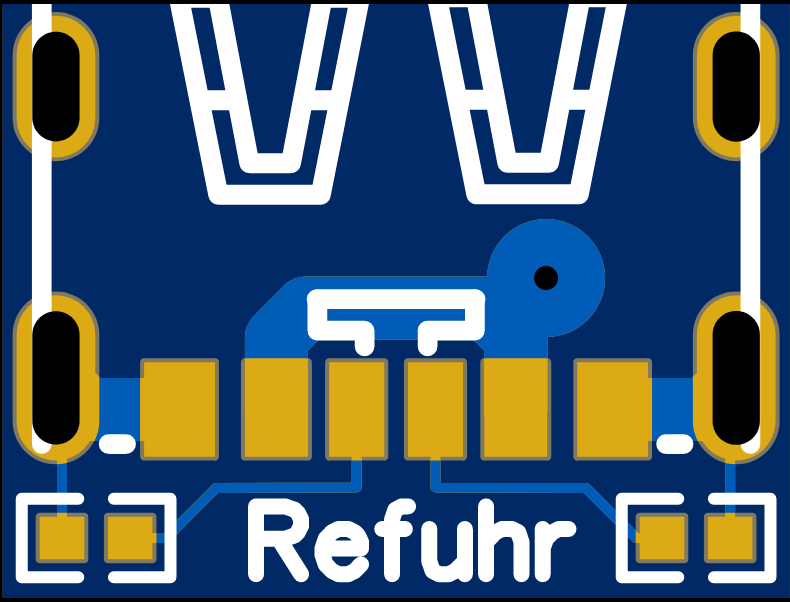
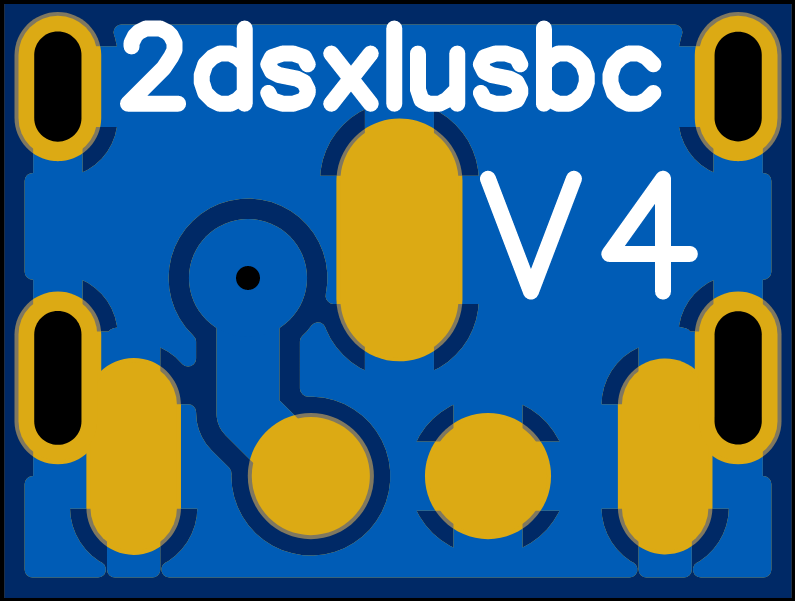

# 2dsxlusbc

This is an adapter PCB designed to put an USB Type C port as the charging port of a Nintendo 2ds XL.  

# Features

This PCB allows your 2ds XL to be charged via USB Type C with an USB A to USB C cable. Additionally, if you use two 5.1k 0402 (0603, 0805, 1206 designs available but not tested yet) resistors it enables USB Type C Host charging, which means that your 2ds should now be compatible with any USB PD Charger.

# What you'll need  
Before you order a PCB you have to decide which PCB version you want to choose. I now have two major differences: with pads for a wireless charging mod (not tested yet) or without. Both versions come in different resistor packages. More information can be found [here](design%20files/README.md).

-the PCB (without the pads), available from oshpark: [0402](https://oshpark.com/shared_projects/pbCMp1gR), [0603](https://oshpark.com/shared_projects/2moRwhC7), [0805](https://oshpark.com/shared_projects/RokBYKXV), [1206](https://oshpark.com/shared_projects/wtxNBJHK) ($0.60 shipped in the US, about 0.70€ shipped in the EU), [gerbers](gerber)  
-the USB Type C port: [Ebay](https://www.ebay.com/itm/153460023680) or [Aliexpress](https://www.aliexpress.com/wholesale?&SearchText=usb+type+c+6+pin) 10X $2-3 (search for: usb type c 6 pin)  
-optional (required for USB C Host charging): two 5.1K 0402 (0603, 0805, 1206 designs available but not tested yet) resistors (available at [local electronics store in Germany](https://www.conrad.de/de/p/tru-components-tc-0402wgf5101tce203-dickschicht-widerstand-5-1-k-smd-0402-0-063-w-1-100-ppm-c-1-st-tape-cut-1585197.html) 10X 0.20€ or Ebay/Aliexpress/Digikey/etc.)  
-soldering iron with solder  
-heat gun for removing the original charging port (can be done without an heat gun, I personally wouldn't recommend it)  
-desoldering braid/desoldering pump  
-flux  

# Installation

Instructions for assembly/installation can be found in [INSTALLATION.md](INSTALLATION.md)  

# PCB

By measuring the pads of the old charging port, I was able to design a [custom footprint](https://easyeda.com/component/d013406ddfa94d40b684a1f854966128) for the charging port of the 2ds xl in easyeda. The PCB with the USB Type C port is held down with solder at the original pads. It seems to be quite strong, but superglue wouldn't hurt to help with the rigidity of the port.  

Feel free to make changes to the design, design files (easyeda) can be found [here](design%20files). There are 4 different versions (0402 \[first version, tested\], 0603, 0805, 1206), wich only differ in the resistor package. For more information on the different versions visit [Version guide](design%20files/README.md).

Top layer 0402:  
  
Bottom layer 0402:  

# Thanks

Thank you to [rorosaurus](https://github.com/rorosaurus/3ds-xl-usb-c) and [makho](https://github.com/makhowastaken/3DS_C) for the inspiration of this PCB!
