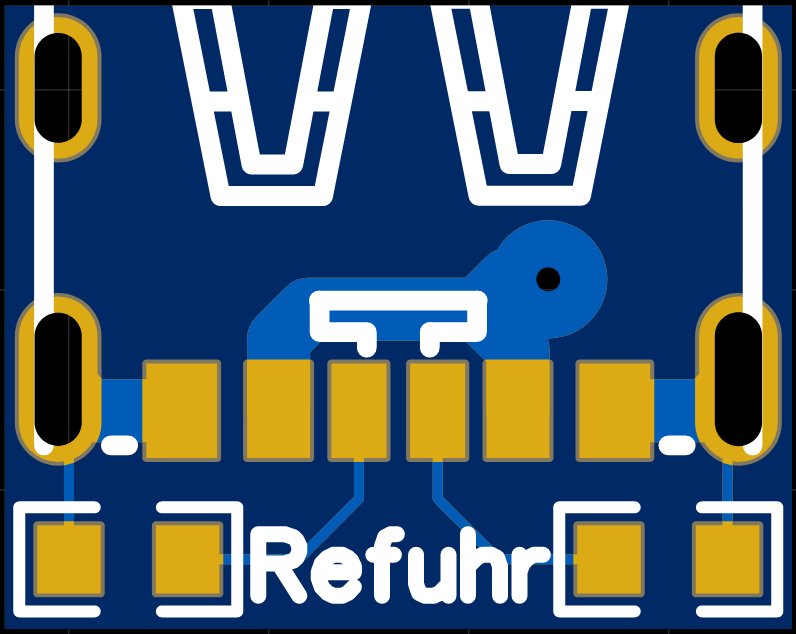
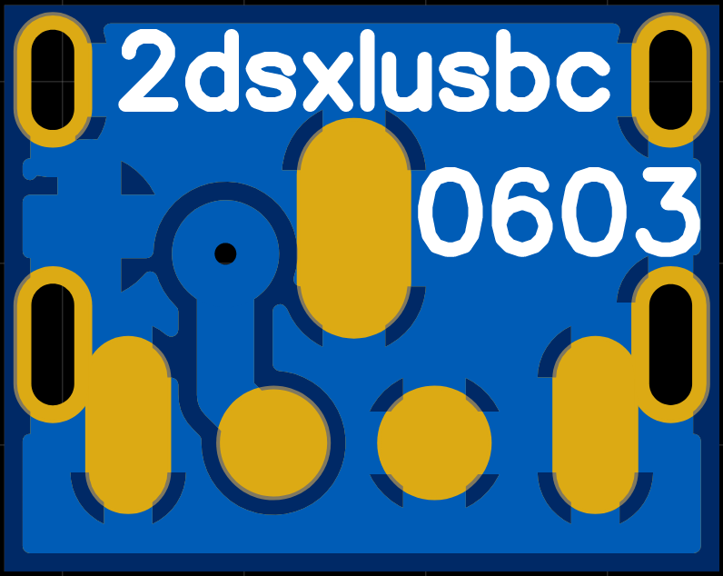
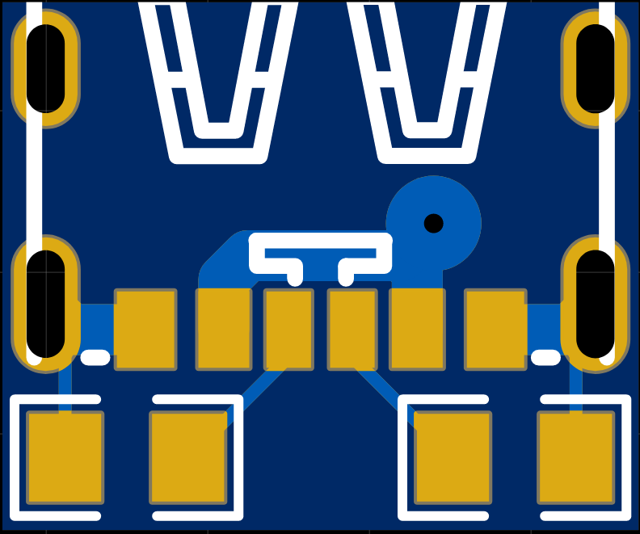
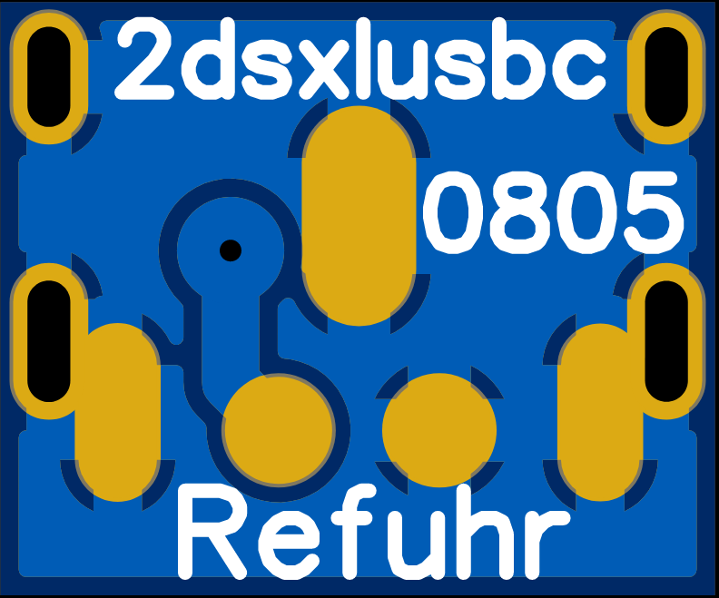
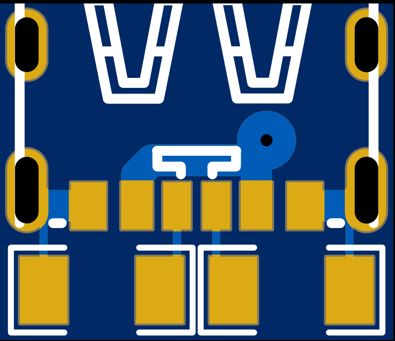
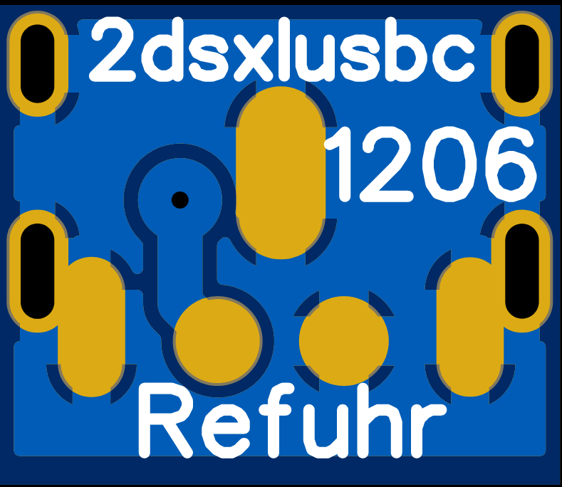

# History of the versions 
At first, I chose 0402 resistors for my hardware design to act as the pulldown resistors. They are incredibly small, which was helpful when trying to make the PCB as small as possible, and I was confident in hand soldering them. When @Ardakilic said that he wasn’t confident in hand soldering them, I designed two additional PCBs with the resistor size of 0603 and 0805. At the End the size difference between the smallest (0402) and the biggest (0805) is about 0.5 mm. So with almost no drawback in size it’s a lot easier to solder the resistors now (0602 and 0805 design not tested yet!). Lastly I added another design which now takes resistor of the size 1206 (1 mm size difference between 0402 and 1206, but should still fit the 2ds xl).  

# Which version to choose and why  
All these versions are only different by the resistor package they use. My standard design was the one with the size of 0402, which is thoroughly tested and is confirmed to be working without any problems. It is small but not so easy to solder. Generally, the bigger the resistors get, the easier it is to solder them in place but also the bigger the PCB gets. I personally would recommend 0603 because it is the perfect compromise between size and being easy to solder. The bigger sizes 0805/1206 would work too and I would recommend them to people who are not that confident in their soldering skills, though you might have to cut off a bit more plastic from the bracket, which keeps the charging port and battery in place. In the end choose the version, for which you can get the resistors the easiest.

# Version guide  
-[0402](0402) initial PCB with 0402 resistor (tested and working perfectly)  
-[0603](0603) slightly bigger 0603 resistors [order via oshpark](https://oshpark.com/shared_projects/2moRwhC7) (not tested!)  
Top layer:  
  
Bottom layer:  
  
-[0805](0805) bigger 0805 resistor [order via oshpark](https://oshpark.com/shared_projects/RokBYKXV) (not tested!)  
Top layer:  
  
Bottom layer:  
  
-[1206](1206) even bigger 1206 resistors [order via oshpark](https://oshpark.com/shared_projects/wtxNBJHK) (not tested!)  
Top layer:  
  
Bottom layer:  
  
